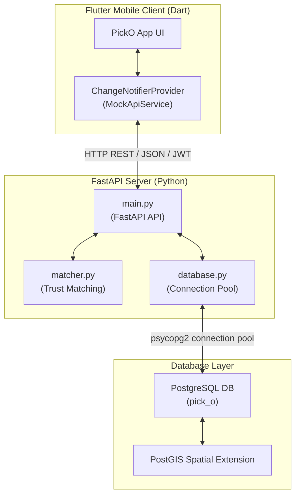

# 🤝 PickO: Trust-Aware Crowdshipping Logistics Platform

PickO is a premium, secure crowdsourced inter-city logistics platform that connects package **Senders** with public transport **Commuters (Travelers)** who are already traveling along the package's route. 

The platform utilizes a **3-step Trust-Aware Spatial Matching Algorithm** to pair packages with high-trust travelers, operates a **locked collateral escrow wallet** system to prevent package theft, and implements a **secure digital handshake QR scanner** to track the package's physical audit trail.

---

## 🏗️ System Architecture

The platform consists of a **FastAPI (Python)** backend, a **PostgreSQL + PostGIS** database, and a **Flutter (Dart)** mobile application.



---

## 🔒 Core Workflows & Security Mechanisms

### 1. The Collateral & Escrow Flow
To guarantee cargo safety, PickO enforces an escrow wallet mechanism for commuters:
1. **Collateral Lock**: When a traveler accepts a parcel, the backend checks if their wallet has an `available_balance` at least equal to the parcel's `liability_value` (capped at Rs. 10,000). 
2. **Escrow Hold**: The liability value is transferred from the traveler's `available_balance` to `locked_escrow_balance`.
3. **Delivery Settlement**: Upon verified delivery, the locked collateral is returned to the traveler's `available_balance`, along with the delivery tip paid by the sender.
4. **Theft Penalty**: If a package is reported stolen, the traveler's locked collateral is permanently deducted and transferred to the sender's wallet to reimburse them for their loss.

```mermaid
sequenceDiagram
    autonumber
    actor Sender
    actor Traveler
    participant Wallet as Escrow Wallet
    participant DB as Postgres Database

    Sender->>DB: 1. Create Parcel (liability_value = Rs. 1,500)
    Note over Traveler, Wallet: Traveler Available Balance: Rs. 2,000
    Traveler->>DB: 2. Accept Parcel
    DB->>Wallet: 3. Verify traveler balance >= liability_value
    Wallet->>Wallet: 4. Lock Rs. 1,500 in Escrow
    Note over Traveler, Wallet: Traveler Available: Rs. 500 | Locked: Rs. 1,500
    
    rect rgb(30, 20, 45)
        note right of Traveler: Pick-up & Transit phase
    end

    Traveler->>Sender: 5. Handover Package (Delivered)
    Sender->>DB: 6. Complete QR Verification
    DB->>Wallet: 7. Unlock Rs. 1,500 collateral + credit Rs. 350 tip
    DB->>Wallet: 8. Deduct Rs. 350 tip from Sender wallet
    Note over Traveler, Wallet: Traveler Available: Rs. 2,350 | Locked: Rs. 0
```



### 2. Secure QR Handshake Checkpoint Scan
Physical handover is audited at two critical checkpoints via **digital QR verification** and location checks:
* **Pickup Scan (Handover to Traveler)**: Senders present a unique `verification_qr_code`. The traveler scans it, uploads a photographic proof of the sealed package (saved to the backend's `/uploads` directory), and their GPS coordinates are logged. The parcel's status transitions to `In Transit`.
* **Dropoff Scan (Handover to Recipient)**: The traveler presents their scanned verification code at the destination. Senders/recipients scan it to verify receipt. The backend automatically settles the wallets, updates the status to `Delivered`, and logs the dropoff location coordinates.

---

## 🧠 Trust-Aware Spatial Matching Algorithm

The platform features a **3-step filter and sort** algorithm to find the ideal traveler for a parcel, implementing geographical filters, destination route matching, and trust gates.

```
                  ┌───────────────────────────────┐
                  │      All Active Travelers     │
                  └───────────────┬───────────────┘
                                  │
                       [Step 1: Spatial Filter]
                                  ▼
                  ┌───────────────────────────────┐
                  │    Travelers within 5km of    │
                  │        pickup location        │
                  └───────────────┬───────────────┘
                                  │
                        [Step 2: Route Filter]
                                  ▼
                  ┌───────────────────────────────┐
                  │  Travelers traveling to the   │
                  │    parcel's dropoff city      │
                  └───────────────┬───────────────┘
                                  │
                      [Step 3: Trust Score Gate]
                                  ▼
                  ┌───────────────────────────────┐
                  │  Travelers passing category   │
                  │      trust & KYC criteria     │
                  └───────────────┬───────────────┘
                                  │
                         [Ranking & Scoring]
                                  ▼
                       ┌─────────────────────┐
                       │   Ranked Matches    │
                       └─────────────────────┘
```

### The 3 Gating Criteria
1. **Spatial Filter**: A traveler must be within **5.0 km** of the package's pickup coordinate.
   * *PostGIS Implementation*: Uses `ST_Distance(geom, geom)` queries on database geography coordinates.
   * *Fallback Implementation*: Uses the mathematical **Haversine Formula**:
     $$d = 2R \arcsin\left(\sqrt{\sin^2\left(\frac{\Delta \phi}{2}\right) + \cos(\phi_1)\cos(\phi_2)\sin^2\left(\frac{\Delta \lambda}{2}\right)}\right)$$
2. **Route Filter**: The traveler's destination/route city must match the parcel's destination dropoff city.
3. **Trust & KYC Gates**: Parcels are categorized, each enforcing a strict trust threshold:
   * **Category A** (Standard goods): Requires traveler **KYC verification**.
   * **Category B** (High-value goods): Requires traveler **KYC verification** + trust score **$\ge$ 80%**.
   * **Category C** (Documents/Contracts): Requires traveler **KYC verification** + trust score **$\ge$ 95%**.
   * **Category D** (Low-value/Flexible): No restrictions.

### Dynamic Trust Score Ranking
Eligible candidates are ranked based on a composite dynamic trust score (out of 100):

$$\text{Dynamic Score} = (\text{Base Trust Score} \times 0.40) + (\text{Success Rate} \times 0.30) + \left(\frac{\text{Rating}}{5.0} \times 20.0\right) + \text{KYC Bonus}$$

* **Base Trust Score** (40% weight): Historical user integrity rating.
* **Success Rate** (30% weight): Percentage of successful deliveries vs total accepted deliveries.
* **Rating** (20% weight): User rating stars (1.0 to 5.0).
* **KYC Bonus** (10 points): Granted to verified accounts.

---

## 🗄️ Database Schema Reference

The PostgreSQL schema automatically adapts. If the **PostGIS** extension is available, it stores locations as `GEOGRAPHY(Point, 4326)` geometries and uses `GIST` indexes for fast spatial lookups. Otherwise, it transparently falls back to `DECIMAL(9, 6)` latitude and longitude columns.

```mermaid
erDiagram
    users ||--|| wallets : "has"
    users ||--o{ parcels : "sends (sender_id)"
    users ||--o{ parcels : "delivers (traveler_id)"
    parcels ||--o{ parcel_scans : "audits"
    users ||--o{ parcel_scans : "performs"

    users {
        UUID id PK
        VARCHAR name
        VARCHAR username UNIQUE
        VARCHAR email UNIQUE
        VARCHAR phone_number
        VARCHAR password_hash
        BOOLEAN is_commuter
        VARCHAR route_city
        DECIMAL current_lat
        DECIMAL current_lng
        BOOLEAN kyc_verified_status
        DECIMAL trust_score
        DECIMAL rating
        TIMESTAMP created_at
    }

    wallets {
        UUID user_id PK, FK
        DECIMAL available_balance
        DECIMAL locked_escrow_balance
    }

    parcels {
        UUID id PK
        UUID sender_id FK
        UUID traveler_id FK
        VARCHAR category_type
        DECIMAL liability_value
        VARCHAR status
        VARCHAR pickup_city
        VARCHAR dropoff_city
        TEXT description
        DECIMAL tip_amount
        DECIMAL pickup_lat
        DECIMAL pickup_lng
        DECIMAL dropoff_lat
        DECIMAL dropoff_lng
        GEOGRAPHY pickup_geom
        GEOGRAPHY dropoff_geom
        VARCHAR verification_qr_code UNIQUE
        VARCHAR sealed_package_photo_url
        VARCHAR receiver_name
        VARCHAR receiver_phone
        INT rating_stars
        TEXT feedback_text
        TIMESTAMP created_at
    }

    parcel_scans {
        UUID id PK
        UUID parcel_id FK
        VARCHAR action
        UUID scanned_by FK
        DECIMAL scan_lat
        DECIMAL scan_lng
        GEOGRAPHY scan_location
        TIMESTAMP scanned_at
    }
```

---

## 🔌 API Registry

### Authentication Endpoints
* **`POST /api/auth/register`**: Register a new user, automatically generates their wallet funded with initial mock cash (Rs. 5,000) and signs a session JWT.
* **`POST /api/auth/login`**: Authenticate using username/email and password to return a session token.
* **`POST /api/auth/forgot-password`**: Verify identity details and reset account credentials.
* **`GET /api/auth/me`**: Retrieve current authenticated user profile payload.
* **`PUT /api/auth/profile`**: Update username, email, or phone number with validation.
* **`DELETE /api/auth/profile`**: Execute cascading profile deletion. Wipes active scans, resets assigned active parcels, drops wallet, and deletes user row.

### User & Traveler Management
* **`GET /api/users`**: Retrieve details of all system users.
* **`GET /api/users/{id}`**: Retrieve a specific profile. Recalculates metrics.
* **`POST /api/users/{id}/kyc`**: Update user KYC verification status (verified updates base trust to 95.00, unverified defaults to 50.00).
* **`POST /api/users/{id}/commuter`**: Apply to upgrade a standard user to Commuter status by specifying their regular transit route and location.

### Wallet & Financial Escrow
* **`GET /api/wallets/{userId}`**: Retrieve escrow wallet balance figures.
* **`POST /api/wallets/{userId}/deposit`**: Deposit mock funds into a user's wallet.
* **`POST /api/wallets/accept`**: traveler locks collateral and accepts a pending parcel.
* **`POST /api/wallets/stolen`**: Penalize a thief. Deducts collateral from traveler escrow and transfers it to the sender's wallet.

### Parcels & Logistics Checkpoint Scans
* **`POST /api/parcels/create`**: Create a new parcel request (Rs. 10,000 maximum limit). Generates handshake QR code.
* **`GET /api/parcels/{id}`**: Retrieve detailed parcel information.
* **`GET /api/parcels`**: Retrieve all parcels listed on the system.
* **`POST /api/parcels/{id}/scan`**: Submit a handover checkpoint scan.
  * Form fields: `action` ('pickup' / 'dropoff'), `qr_code`, `lat`, `lng`, and optional `photo` payload.
* **`POST /api/parcels/{id}/rate`**: Rate a delivery (1 to 5 stars) and provide feedback text. Automatically recalculates traveler average rating and updates their trust score.
* **`GET /api/parcels/{id}/tracking`**: Retrieve full checkpoint scanning history for tracking logs.
* **`GET /api/parcels/{id}/matches`**: Retrieve ranked matching commuters sorted by eligibility.
* **`POST /match`**: Stateless matching algorithm engine endpoint.

---

## 🛠️ Installation & Setup

### Prerequisites
* **Python**: v3.8 or above
* **Flutter**: SDK v3.0.0 or above
* **PostgreSQL** with **PostGIS** extension (Falls back gracefully to plain PostgreSQL or sqlite schemas if PostGIS isn't found).

### 🐍 Backend Setup
1. Open a terminal and navigate to the backend directory:
   ```bash
   cd backend
   ```
2. Create and activate a Python virtual environment:
   ```bash
   python -m venv venv
   # On Windows (PowerShell):
   .\venv\Scripts\Activate.ps1
   # On Linux/macOS:
   source venv/bin/activate
   ```
3. Install package dependencies:
   ```bash
   pip install -r requirements.txt
   ```
4. Set up database credentials in a `.env` file inside the `backend` directory:
   ```env
   DB_HOST=localhost
   DB_PORT=5432
   DB_USER=postgres
   DB_PASSWORD=your_password
   DB_NAME=pick_o
   JWT_SECRET_KEY=picko_super_secret_key_123456
   ```
5. Start the FastAPI development server:
   ```bash
   uvicorn main:app --reload --host 0.0.0.0 --port 8080
   ```

### 📱 Frontend Setup
1. Navigate to the frontend directory:
   ```bash
   cd frontend
   ```
2. Fetch package dependencies:
   ```bash
   flutter pub get
   ```
3. Check connected devices and run the app:
   ```bash
   flutter devices
   flutter run -d <device-id>
   ```

---

## 🧪 Testing

The backend includes a comprehensive test suite in `test_backend.py` covering validation rules, escrow locking, trust gates, spatial lookups, stolen cargo penalties, rating updates, and auth flows.

To run tests:
1. Ensure your backend environment is active.
2. Run the test script:
   ```bash
   python test_backend.py
   ```
